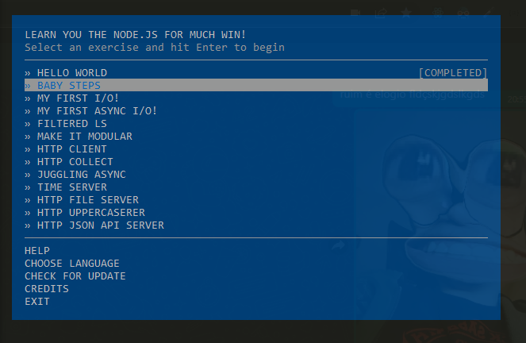

<h1>My Learn You Node</h1>

My checklist:

<ul>
  <li>✅ > HELLO WORLD</li>
  <li>🟥 > BABY STEPS</li>
  <li>🟥 > MY FIRST I/O!</li>
  <li>🟥 > MY FIRST ASYNC I/O!</li>
  <li>🟥 > FILTERED LS</li>
  <li>🟥 > MAKE IT MODULAR</li>
  <li>🟥 > HTTP CLIENT</li>
  <li>🟥 > HELLO WORLD</li>
  <li>🟥 > HTTP COLLECT</li>
  <li>🟥 > HELLO WORLD</li>
  <li>🟥 > HELLO WORLD</li>
  <li>🟥 > JUGGLING ASYNC</li>
  <li>🟥 > TIME SERVER</li>
  <li>🟥 > HTTP FILE SERVER</li>
  <li>🟥 > HTTP UPPERCASERER</li>
  <li>🟥 > HTTP JSON API SERVER</li>
</ul>

References:

<ul>
  <li><a href="https://nodeschool.io/">node school</a></li>
  <li><a href="https://github.com/workshopper/learnyounode">repo learnyounode</a></li>
</ul>
